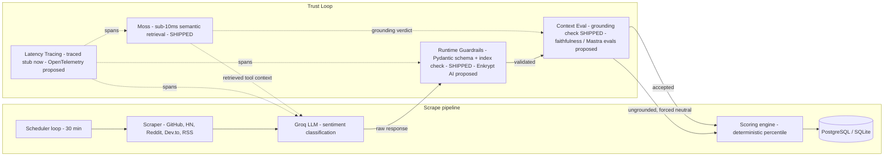
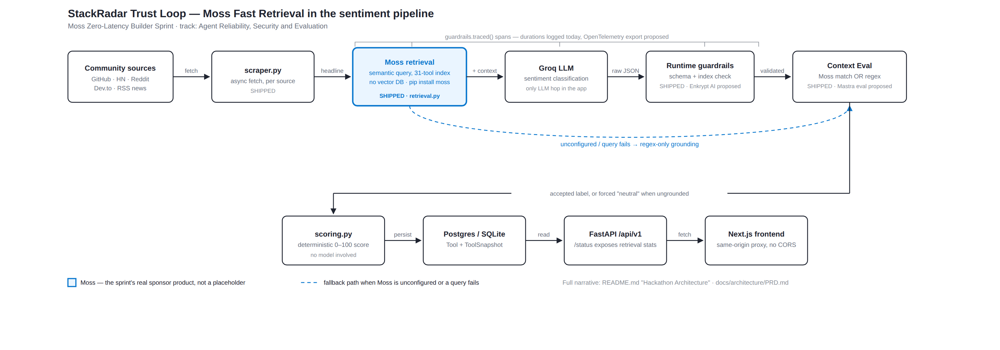

<h1 align="center">
  🛰️ StackRadar
</h1>

<p align="center">
  <strong>Real-time tech intelligence engine</strong> — tracks 30+ tools across GitHub, HackerNews, Dev.to & Reddit, scored by an AI-powered pipeline with user authentication and personal watchlists.
</p>

<p align="center">
  
  
  
  
  
  
</p>

---

## 🎯 What is StackRadar?

StackRadar automatically monitors the developer ecosystem every 30 minutes, fetching signals from:

- ⭐ **GitHub** — Stars, forks, open issues, growth rate (authenticated API with rate limit handling)
- 🟠 **HackerNews** — Front-page mentions with sentiment
- 📝 **Dev.to** — Article mentions with engagement
- 🔴 **Reddit** — r/programming hot post mentions
- 📰 **Tech News** — TechCrunch, Ars Technica, The Verge RSS feeds
- 🤖 **AI Sentiment** — Groq LLM (Llama 3) analyzes community sentiment per tool

Each tool gets a **composite score (0–100)** using logarithmic normalization weighted by GitHub Stars (45%), Forks (20%), and community mentions (5% per source), with AI-generated recommendations and learning priority classification.

---

## 🏗️ Architecture

```
┌──────────────────────────────────────────────┐
│                  Frontend                     │
│    Next.js 16 + Tailwind + Recharts + Clerk  │
│           ISR Caching (30 min)               │
│                 :3000                         │
└─────────────────┬────────────────────────────┘
                  │ REST API
┌─────────────────▼────────────────────────────┐
│                 Backend                       │
│     FastAPI + SQLAlchemy + slowapi + loguru   │
│               :8000                           │
│  ┌──────────┐ ┌────────────┐ ┌────────────┐ │
│  │ Scraper  │ │  Scoring   │ │ Sentiment  │ │
│  │ (30min)  │ │  Engine    │ │ (Groq LLM) │ │
│  └──────────┘ └────────────┘ └────────────┘ │
└─────────────────┬────────────────────────────┘
                  │
┌─────────────────▼────────────────────────────┐
│        PostgreSQL (Docker) / SQLite (Dev)     │
└──────────────────────────────────────────────┘
```

---

## 🛡️ Hackathon Architecture: Agent Reliability & Security

> Produced for the **Moss Zero-Latency Builder Sprint** — track *Agent Reliability,
> Security and Evaluation*. Scoped honestly: the **runtime guardrail**, **Context
> Eval** grounding, and **Fast Retrieval** are a working prototype in this repo
> (`app/services/guardrails.py`, `app/services/retrieval.py`); the remaining
> named third-party stack — **Enkrypt AI** (guardrails), **Mastra** (agent evals +
> tracing) — is **designed in, not yet wired**. Each row below is tagged with its
> real status.
>
> *Correction:* an earlier draft of this section (and the PRD) called "Moss" the
> sprint arena's codename for a Qdrant placeholder. That was wrong — Moss is the
> sprint's actual sponsor product (a sub-10ms semantic search runtime, no vector
> database to run or tune) — and Fast Retrieval below now runs on the real
> `moss` SDK instead of the Qdrant placeholder.

### Where the LLM actually sits today

StackRadar is mostly deterministic. Scoring (`app/services/scoring.py`) is pure
percentile math over GitHub + community signals — no model involved. The **only** LLM
call on the live path is a single Groq request per scrape cycle that classifies
community sentiment (`batch_sentiment_analysis` in `app/services/scraper.py`), and it
is a no-op when `GROQ_API_KEY` is unset. There is no agent, no retrieval-augmented
generation, and no user-facing text generation yet.

That single call is the seam this layer wraps, and the seam any future generative
feature (e.g. an "explain this trend" agent) would pass through.

### The "Trust Loop"

| Component | Tech (prototype → production target) | Status | Role |
|-----------|------|--------|------|
| **Runtime Guardrails** | Pydantic v2 → **Enkrypt AI** | ✅ prototype in repo | Every model response is validated against a strict schema (`SentimentVerdict`) before any sentiment reaches `scoring.py`. Malformed rows are dropped, a fully unparseable response rejects the whole batch, and a verdict whose index is outside the batch (a hallucinated index) is discarded. Anything not explicitly accepted stays at the safe `neutral` default. Enkrypt AI would add hallucination / safety / PII detectors on the same seam. |
| **Context Eval** (grounding) | Python `scoring` regex → **Mastra evals** | ✅ prototype in repo | A non-neutral verdict is kept only if the source headline actually mentions a tracked tool (`scoring.classify_text_to_tools`). Sentiment that can't be grounded in our domain is quarantined to `neutral` rather than persisted. Faithfulness scoring against retrieved context is the proposed extension. |
| **Fast Retrieval** | **Moss** (`pip install moss`, `app/services/retrieval.py`) | ✅ shipped | Every scraped headline is semantically queried against a Moss index of the 31-tool catalog before the Groq call. A high-confidence match grounds the verdict (catching paraphrases the regex misses — "k8s", "the Rust compiler", "Next") and its text is folded into the classification prompt as context instead of the bare headline. No-op, falling back to the regex-only check, when `MOSS_PROJECT_ID`/`MOSS_PROJECT_KEY` are unset — same degrade-gracefully contract as every other key in this repo. Per-cycle stats (`configured`, `queried`, `grounded`, `avg_latency_ms`) are on `GET /api/v1/status` → `retrieval`. Offline proof: `backend/scripts/check_retrieval.py`. |
| **Latency Tracing** | `guardrails.traced()` → **OpenTelemetry** / Mastra | ◑ stub in repo | Wraps the inference and validation hops and logs span durations today; swapping in a real exporter leaves the call sites unchanged. |



**The loop:** `Moss (semantic retrieval, sub-10ms) → LLM → runtime guardrails
(schema + index) → Context Eval (grounding) → persist or quarantine`, with tracing
around every hop. Nothing the LLM produces is written to the database until it has
passed the guardrail schema check and cleared the grounding check. Offline proof:
`backend/scripts/check_guardrails.py` runs the guardrail against well-formed,
malformed, hallucinated-index and ungrounded responses with no network or API key;
`backend/scripts/check_retrieval.py` does the same for Moss retrieval, and prints
live per-query latency when real credentials are present.

Full requirements, milestones and open risks: [`docs/architecture/PRD.md`](./docs/architecture/PRD.md).

**Submission architecture diagram:**



Source (hand-authored SVG, edit directly rather than regenerating):
[`docs/architecture/trust-loop-moss.svg`](./docs/architecture/trust-loop-moss.svg).

An earlier conceptual diagram from the sprint design tool is kept at
[`docs/architecture/proposed-reliability-layer.pdf`](./docs/architecture/proposed-reliability-layer.pdf)
([PNG](./docs/architecture/proposed-reliability-layer.png)) for history only — it predates
the real Moss integration, still shows the retired Qdrant placeholder, and its "Existing
Infrastructure" boxes are a generic template that differs from the real stack (e.g. the
collector is Python, not Node.js; there is no Kong gateway). The diagram above and the
Mermaid diagram earlier in this section are the accurate current-state reference.

---

## 📸 Pages

| Page | Description |
|------|-------------|
| **Dashboard** (`/`) | Tool cards with scores, search bar, category filters, bookmark buttons |
| **Trends** (`/trends`) | Bar chart of all tool scores + compact cards |
| **Compare** (`/compare`) | Side-by-side comparison of 2–5 tools with metrics table + history overlay chart |
| **Explore** (`/explore`) | Domain-level view with expandable tool lists |
| **Roadmaps** (`/roadmaps`) | Curated learning roadmaps (e.g. "Become a DevOps Engineer") |
| **Tool Detail** (`/tools/[slug]`) | Deep-dive with history chart, sentiment, GitHub stats, SEO metadata |
| **Watchlist** (`/watchlist`) | Personal bookmarked tools (requires sign-in via Clerk) |

---

## 🚀 Quick Start

### Option 1: Docker (Recommended)

```bash
# Clone the repo
git clone https://github.com/amantebriwal4321/StackRadar.git
cd StackRadar

# Add your API keys
cp backend/.env.example backend/.env
cp frontend/.env.example frontend/.env.local
# Edit both files with your actual keys

# Start everything
docker-compose up --build
```

- Frontend: http://localhost:3000
- Backend API: http://localhost:8000
- API Docs: http://localhost:8000/docs

### Option 2: Local Development

**Backend:**
```bash
cd backend
python -m venv venv
.\venv\Scripts\Activate.ps1   # Windows
# source venv/bin/activate    # Mac/Linux

pip install -r requirements.txt

# Create .env file with your keys (see Environment Variables below)
python -m uvicorn app.main:app --host 0.0.0.0 --port 8000
```

**Frontend:**
```bash
cd frontend
npm install

# Create .env.local with your Clerk keys (see Environment Variables below)
npm run dev
```

---

## 🔑 Environment Variables

### Backend (`backend/.env`)

| Variable | Required | Description |
|----------|----------|-------------|
| `GITHUB_TOKEN` | ✅ | GitHub Personal Access Token (classic, `repo:read` scope) |
| `GROQ_API_KEY` | ✅ | Groq API key for LLM sentiment analysis |
| `DATABASE_URL` | ❌ | PostgreSQL URL (auto-set by Docker; defaults to SQLite) |
| `ADMIN_API_KEY` | ❌ | Secret key for `POST /admin/scrape` manual trigger |

### Frontend (`frontend/.env.local`)

| Variable | Required | Description |
|----------|----------|-------------|
| `BACKEND_ORIGIN` | ❌ | Where the Next server proxies `/api/v1/*` (read at **build** time; defaults to `http://localhost:8000`, docker-compose sets `http://backend:8000`) |
| `NEXT_PUBLIC_SITE_URL` | ❌ | Absolute site URL for OG/canonical/sitemap |
| `NEXT_PUBLIC_CLERK_PUBLISHABLE_KEY` | ✅ | Clerk publishable key from [dashboard.clerk.com](https://dashboard.clerk.com) |
| `CLERK_SECRET_KEY` | ✅ | Clerk secret key |

---

## 📡 API Reference

| Method | Endpoint | Description |
|--------|----------|-------------|
| `GET` | `/api/v1/tools` | All tools (paginated: `?page=1&per_page=20&category=AI / ML`) |
| `GET` | `/api/v1/tools/compare?slugs=react,rust` | Compare 2–5 tools side by side |
| `GET` | `/api/v1/tools/{slug}` | Tool detail with decision intelligence |
| `GET` | `/api/v1/tools/{slug}/history?days=30` | Time-series score data (30/90/365 days) |
| `GET` | `/api/v1/domains` | Domain-level summaries |
| `GET` | `/api/v1/domains/{slug}/learning-path` | Ordered learning path for a domain |
| `GET` | `/api/v1/roadmaps` | All learning roadmaps |
| `GET` | `/api/v1/roadmaps/{slug}` | Full roadmap with steps and resources |
| `GET` | `/api/v1/status` | Scraper status with real-time progress |
| `GET` | `/api/v1/health` | Health check (DB connectivity + last scrape time) |
| `GET` | `/api/v1/ready` | Readiness probe (503 if < 10 tools seeded) |
| `POST` | `/api/v1/admin/scrape` | Manual scrape trigger (requires `X-Admin-Key` header) |

---

## 🛠️ Tech Stack

| Layer | Technology |
|-------|-----------|
| **Frontend** | Next.js 16, React 19, TypeScript, Tailwind CSS 4, Recharts, Framer Motion, Lucide Icons |
| **Auth** | Clerk (`@clerk/nextjs`) — Google, email, social login |
| **Caching** | ISR (Incremental Static Regeneration) — 30-minute revalidation |
| **Backend** | Python 3.10, FastAPI, SQLAlchemy 2.x, Alembic, Pydantic v2 |
| **Logging** | Loguru (structured, rotating file logs, JSON in production) |
| **Security** | slowapi rate limiting (60 req/min per IP), CORS hardening |
| **AI/ML** | Groq LLM (Llama 3.3 70B) for batch sentiment analysis |
| **Data Sources** | GitHub API, HackerNews Firebase API, Dev.to API, Reddit RSS, News RSS |
| **Database** | PostgreSQL 15 (production, pooled connections), SQLite (development) |
| **Infrastructure** | Docker, Docker Compose, Kubernetes manifests, GitHub Actions CI |
| **SEO** | Dynamic `generateMetadata()`, `sitemap.xml`, `robots.txt` |

---

## 📂 Project Structure

```
StackRadar/
├── backend/
│   ├── app/
│   │   ├── api/endpoints/mvp.py   # All API routes (tools, domains, roadmaps, health)
│   │   ├── core/config.py         # Pydantic settings & env vars
│   │   ├── db/                    # SQLAlchemy session, base, connection pooling
│   │   ├── models/all_models.py   # Tool, Domain, ToolSnapshot, Roadmap models
│   │   └── services/
│   │       ├── scheduler.py       # Background scraper loop (30-min cycle)
│   │       ├── scraper.py         # GitHub, HN, Dev.to, Reddit, News fetchers
│   │       ├── scoring.py         # TOOL_REGISTRY + logarithmic scoring engine
│   │       └── seed.py            # Initial data seeding (tools, domains, roadmaps)
│   ├── logs/                      # Rotating log files (loguru)
│   ├── alembic/                   # Database migrations
│   ├── Dockerfile
│   └── requirements.txt
├── frontend/
│   ├── src/
│   │   ├── app/                   # Next.js pages (/, /trends, /compare, /watchlist, etc.)
│   │   │   ├── sitemap.ts         # Dynamic sitemap for SEO
│   │   │   ├── robots.ts          # robots.txt configuration
│   │   │   └── watchlist/         # User watchlist (Clerk auth required)
│   │   ├── components/            # Navbar, TrendCard, WatchlistButton, ChartContainer
│   │   └── data/trends.ts         # API client & TypeScript types (ISR cached)
│   ├── Dockerfile
│   └── package.json
├── infrastructure/
│   └── kubernetes/deployment.yaml # K8s deployment with health/readiness probes
├── .github/workflows/
│   ├── backend.yml                # Backend CI (lint + Docker build)
│   └── frontend.yml               # Frontend CI (TypeScript + build)
├── docker-compose.yml
├── CHANGELOG.md
└── changelog_2026-05-16.md        # Detailed phase-by-phase changelog
```

---

## 🧪 Development

```bash
# Run backend with hot reload
cd backend && python -m uvicorn app.main:app --reload

# Production build check (frontend)
cd frontend && npm run build

# Type-check frontend
cd frontend && npx tsc --noEmit

# Run Alembic migrations
cd backend
alembic revision --autogenerate -m "description"
alembic upgrade head
```

---

## 📝 Changelog

See [CHANGELOG.md](./CHANGELOG.md) for the original development history, and [changelog_2026-05-16.md](./changelog_2026-05-16.md) for the Phase 1-5 production upgrade changelog.

---

## 📜 License

MIT — see [LICENSE](./LICENSE) for details.
